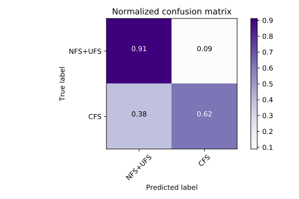

**Fake news and the spread of misinformation** is nothing new. But, due to recent events, big players like Google and Facebook are now trying to clamp down on the problem. Automated end-to-end fact-checking can play a crucial role in this fight and recent success of [the Claimbuster-project](http://idir-server2.uta.edu/claimbuster/) has paved the way for developing such a system.

The starting point for any fact-checking process is the **identification of** interesting claims or statements that present facts. These kinds of sentences are defined as **Check-worthy Factual Statement**. Only when such sentences can be reliably identified, can they be sent to the next step in the pipeline that actually tries to falsify the interesting claims.

The goal of this project to take the first step towards developing such a fact-checking system for the **Dutch** language, with a focus on identifying Check-worthy Factual Statements.  A linear classifier was trained on **1800** hand-classified **statements** in order to predict the probability of check-worthiness when provided with a statement. A demonstration of its current ability can be found on the [front page](/#/) in the from of a rank of Dutch statements made during the last Plenary Meeting of the Belgian Federal parliament based on their check-worthiness. To provide you with the ability to play around with input of your own and see how this is interpreted by FactRank, we made a little [demo](/#/demo).

### Classifier



|              | precision |  recall  | f1-score | support |
| -------------|-----------| ---------|----------|---------|
| NFS+UFS      | 0.89      | 0.91     |  0.90    |    1384 |
|    CFS       | 0.66      | 0.62     |  0.64    |     396 |
|**avg/total** | **0.84**  | **0.85** |**0.84**  |**1780** |


### Project Structure

  ```
  ├── demo
  |     └─ Vue.js front-end to provide insight in prediction process
  |
  ├── helper.py
  |     └─ Custom feature transformer classes allowing for easy predictions
  ├── extractor.py
  |     └─ Exctractor class enables retrieving all nlp features from `sentence`
  |
  ├── learner.py
  |     └─ Preprocess data, construct pipeline, train SVM and export model.
  └── parser.py
  |     └─ Parse latest transcript of plenary meeting, detect Check-Worthy statements
  |        and save predictions together with feedback to be served on demo page.
  |
  └── endpoint.py
        └─ Load pre-trained model and provide endpoint for predictions.
  ```
